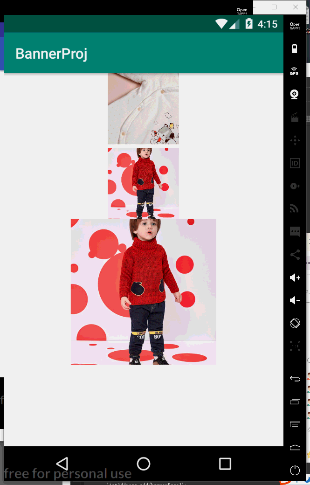
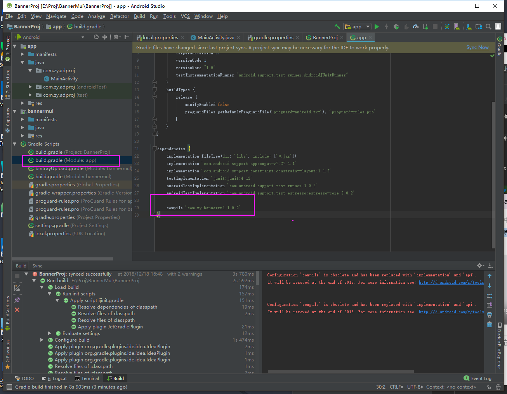
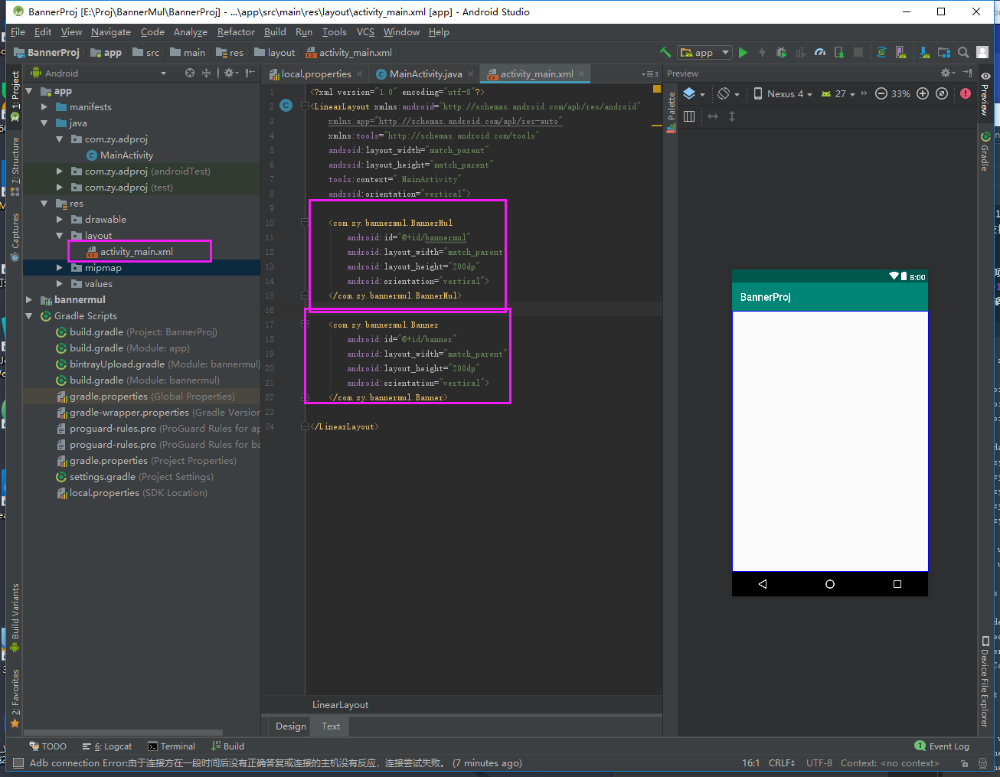
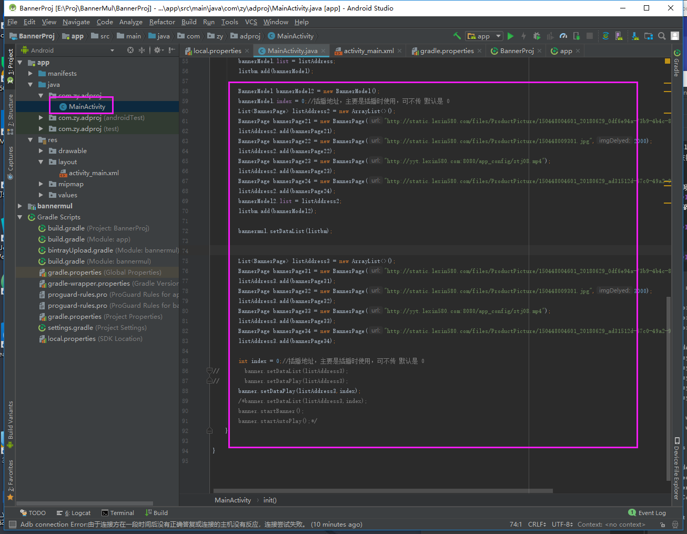

# BannerMul
轮播UI库，支持图片轮播（每张图片的都可设置停留时间），</br>视频轮播（自动播放，播放完毕可自动切换），</br>并支持多屏或单屏幕，自定义屏幕大小</br>（正在开发封装中）

### 效果展示


### 使用
##### 1.在项目依赖中添加 compile 'com.zy:bannermul:1.0.0'

##### 2.代码调用
###### 2.1 layout布局文件代码


###### 2.2 Acitivity文件代码


```java
package com.zy.adproj;

import android.support.v7.app.AppCompatActivity;
import android.os.Bundle;
import android.util.Log;

import com.danikula.videocache.HttpProxyCacheServer;
import com.zy.bannermul.Banner;
import com.zy.bannermul.BannerModel;
import com.zy.bannermul.BannerMul;
import com.zy.bannermul.BannerPage;
import com.zy.bannermul.MyFileNameGenerator;

import java.util.ArrayList;
import java.util.List;

public class MainActivity extends AppCompatActivity {

    @Override
    protected void onCreate(Bundle savedInstanceState) {
        super.onCreate(savedInstanceState);
        setContentView(R.layout.activity_main);

        init();
    }

    private void init(){
        BannerMul bannermul = (BannerMul) findViewById(R.id.bannermul);
        Banner banner = (Banner) findViewById(R.id.banner);

        List<BannerModel> listbm = new ArrayList<>();

        /**
         * mode 模式（1,2,3），可不传，默认是1；
         * // 1.一屏(data一个成员)；
         * // 2.二屏(data二个成员)；
         * // 3.三屏(data三个成员)
         * **/
        BannerModel.mode = 2;

        BannerModel.setScreenPercent1(0.5f);//屏幕1占整个屏幕的高度的的百分比（大于1屏有效）可不传，默认0.5
        BannerModel.setScreenPercent2(0.5f);//屏幕2占整个屏幕的宽度的的百分比（大于2屏有效）可不传，默认0.5

        BannerModel bannerModel = new BannerModel();
        bannerModel.index = 0;//插播地址，主要是插播时使用，可不传 默认是 0
        List<BannerPage> listAddress = new ArrayList<>();
        BannerPage bannerPage1 = new BannerPage("http://static.lexin580.com/files/ProductPicture/150448004601_20180629_0df6e94a-73b9-4b4c-8b44-89bd74755943.jpg",2000);
        listAddress.add(bannerPage1);
        BannerPage bannerPage2 = new BannerPage("http://static.lexin580.com/files/ProductPicture/150448009301.jpg",3000);
        listAddress.add(bannerPage2);
        BannerPage bannerPage3 = new BannerPage("http://yyt.lexin580.com:8080/app_config/ztj08.mp4");
        listAddress.add(bannerPage3);
        BannerPage bannerPage4 = new BannerPage("http://static.lexin580.com/files/ProductPicture/150448004601_20180629_ad31512d-67c0-49a2-917e-71ff8d31b353.jpg",2000);
        listAddress.add(bannerPage4);
        bannerModel.list = listAddress;
        listbm.add(bannerModel);

        BannerModel bannerModel2 = new BannerModel();
        bannerModel.index = 0;//插播地址，主要是插播时使用，可不传 默认是 0
        List<BannerPage> listAddress2 = new ArrayList<>();
        BannerPage bannerPage21 = new BannerPage("http://static.lexin580.com/files/ProductPicture/150448004601_20180629_0df6e94a-73b9-4b4c-8b44-89bd74755943.jpg",1000);
        listAddress2.add(bannerPage21);
        BannerPage bannerPage22 = new BannerPage("http://static.lexin580.com/files/ProductPicture/150448009301.jpg",2000);
        listAddress2.add(bannerPage22);
        BannerPage bannerPage23 = new BannerPage("http://yyt.lexin580.com:8080/app_config/ztj08.mp4");
        listAddress2.add(bannerPage23);
        BannerPage bannerPage24 = new BannerPage("http://static.lexin580.com/files/ProductPicture/150448004601_20180629_ad31512d-67c0-49a2-917e-71ff8d31b353.jpg",2000);
        listAddress2.add(bannerPage24);
        bannerModel2.list = listAddress2;
        listbm.add(bannerModel2);

        bannermul.setDataList(listbm);


        List<BannerPage> listAddress3 = new ArrayList<>();
        BannerPage bannerPage31 = new BannerPage("http://static.lexin580.com/files/ProductPicture/150448004601_20180629_0df6e94a-73b9-4b4c-8b44-89bd74755943.jpg",1000);
        listAddress3.add(bannerPage31);
        BannerPage bannerPage32 = new BannerPage("http://static.lexin580.com/files/ProductPicture/150448009301.jpg",3000);
        listAddress3.add(bannerPage32);
        BannerPage bannerPage33 = new BannerPage("http://yyt.lexin580.com:8080/app_config/ztj08.mp4");
        listAddress3.add(bannerPage33);
        BannerPage bannerPage34 = new BannerPage("http://static.lexin580.com/files/ProductPicture/150448004601_20180629_ad31512d-67c0-49a2-917e-71ff8d31b353.jpg",2000);
        listAddress3.add(bannerPage34);

        int index = 0;//插播地址，主要是插播时使用，可不传 默认是 0
//        banner.setDataList(listAddress3);
//        banner.setDataPlay(listAddress3);
        banner.setDataPlay(listAddress3,index);
        /*banner.setDataList(listAddress3,index);
        banner.startBanner();
        banner.startAutoPlay();*/
    }

}

```

### 欢迎交流
欢迎提问交流；若有bug，请添加bug截图或代码片段，以便更快更好的解决问题。<br>
欢迎大家一起交流

### [我的博客](http://blog.sina.com.cn/s/articlelist_6078695441_0_1.html)

